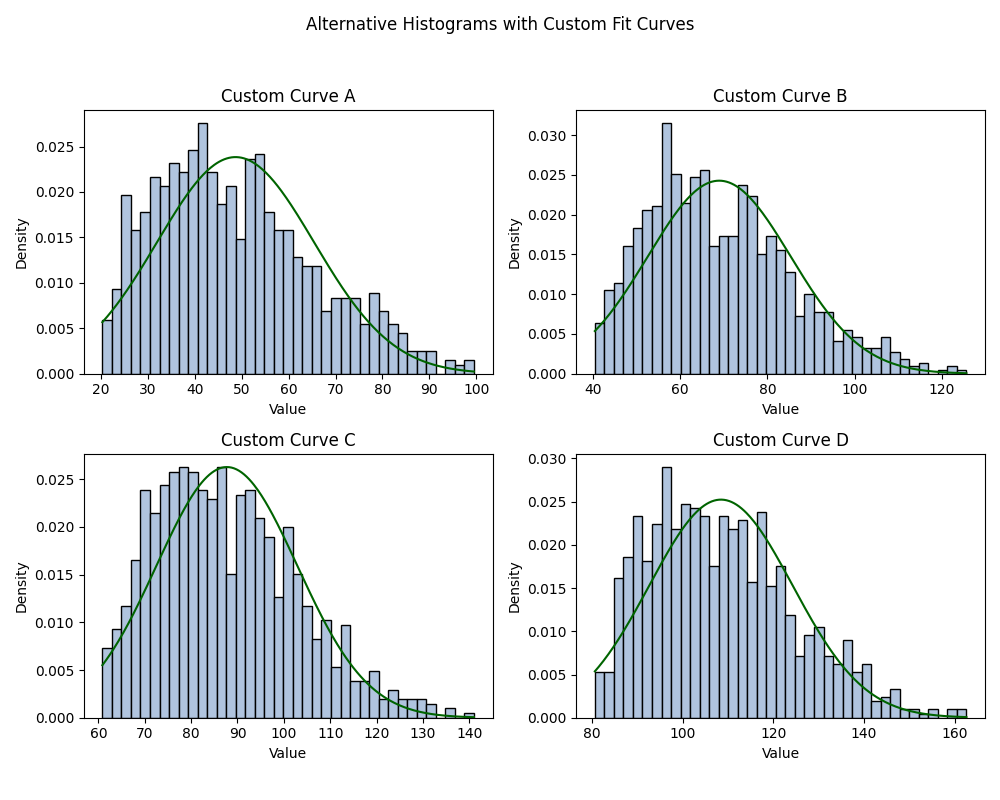

# Histogram with Custom Curve Fitting

This Python project visualizes histograms generated from synthetic datasets and overlays **custom smoothed curves** that resemble normal distributions without exactly replicating them.

The goal is to explore and illustrate distribution shape fitting while avoiding textbook-style statistical overlays, making this safe for portfolio use and educational demo purposes.

## 📊 Features
- Generates 4 different histograms from modified Beta distributions
- Overlays smooth, bell-like fit curves (non-standard)
- Uses custom seeds and location shifts for diversity
- Clean subplot layout with titles and labels

## 🧠 What You Learn
- Custom data simulation using `np.random.beta`
- Fitting and visualizing using `matplotlib`
- Overlaying fitted curves without invoking `scipy.stats` or textbook distributions
- Subplot customization and labeling

## 🛠️ Technologies
- Python 3.x
- `matplotlib`
- `numpy`

## 📷 Output Preview



## 🚀 How to Run
```bash
python normal_curve_histograms.py
```

## 💡 Future Ideas
- Add toggle for standard vs. custom fit
- Export each subplot to a separate image
- Enable CLI options for seed, shape, or bin count

## 👩‍💻 Author
Nasim Bayati

---
This project is intended for personal learning and demonstration. It avoids duplicating assignment visuals or structures.
